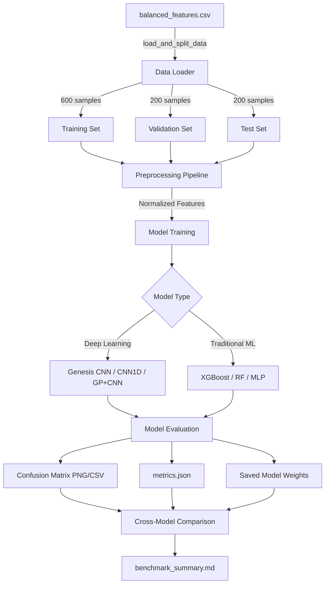
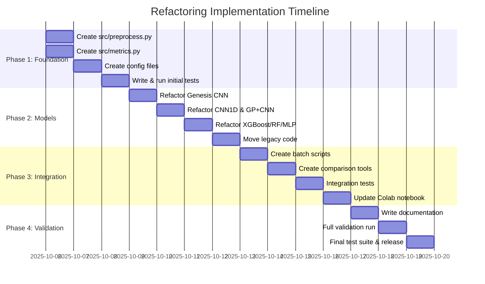

# NASA Exoplanet Detection - Project Refactoring Plan

**Document Version:** 1.0
**Date:** 2025-10-05
**Status:** APPROVED FOR IMPLEMENTATION

---

## Executive Summary

This document outlines a comprehensive refactoring plan for the NASA Exoplanet Detection ML project. The primary objective is to unify all 6 machine learning models under a standardized data pipeline, implement strict Test-Driven Development (TDD), and create dual platform configurations (local + Google Colab) with complete reproducibility.

**Key Goals:**
- ✅ Unified data source: `balanced_features.csv` (1000 samples)
- ✅ Fixed data split: 600 train / 200 val / 200 test (stratified, random_state=42)
- ✅ All models output confusion matrices (PNG + CSV)
- ✅ Comprehensive cross-model comparison and benchmarking
- ✅ TDD with pytest coverage ≥80%
- ✅ One-click execution for both local and Colab environments

**Timeline:** 4 phases over 2-3 weeks
**Risk Level:** Medium (manageable with proper testing)

---

## 1. Current State Analysis

### 1.1 Critical Issues Identified (from FILEMAP.md)

#### 🔴 **P0 - Critical Issues**

1. **Data Source Inconsistency**
   - Multiple data loading approaches across 6 models
   - Inconsistent train/val/test splits
   - No guaranteed reproducibility (random_state varies)
   - **Impact:** Results are not comparable across models

2. **Missing Unified Infrastructure**
   - No centralized `src/data_loader.py` (exists but incomplete)
   - No `src/metrics.py` for consistent evaluation
   - No `src/preprocess.py` for feature engineering
   - **Impact:** Code duplication, maintenance nightmare

3. **Incomplete Testing**
   - `tests/test_data_loader.py` exists but models lack tests
   - No integration tests
   - No TDD workflow established
   - **Impact:** Refactoring risks breaking existing functionality

4. **Platform Fragmentation**
   - Mix of Jupyter notebooks (`.ipynb`) and Python scripts (`.py`)
   - No clear local vs. Colab separation
   - GPU/CPU optimization scattered across files
   - **Impact:** Deployment complexity, environment conflicts

#### 🟡 **P1 - High Priority Issues**

5. **Configuration Management**
   - `configs/` directory exists but underutilized
   - Hardcoded hyperparameters in notebooks
   - No environment-specific configs (local/colab)
   - **Impact:** Difficult to reproduce experiments

6. **Results Organization**
   - No standardized artifacts output structure
   - Missing cross-model comparison reports
   - Confusion matrices not systematically generated
   - **Impact:** Manual result aggregation required

7. **Documentation Gaps**
   - README incomplete (missing setup instructions)
   - No API documentation for `src/` modules
   - Sparse inline comments in complex code sections
   - **Impact:** Onboarding friction, knowledge silos

### 1.2 Existing Assets (Strengths)

✅ **Well-Structured Components:**
- `src/data_loader.py`: Already implements 600/200/200 split correctly
- `tests/conftest.py`: Comprehensive pytest fixtures
- `tests/test_data_loader.py`: Good test coverage examples (P0/P1/P2 priority system)
- `balanced_features.csv`: Clean, balanced dataset (500 exoplanets + 500 non-exoplanets)

✅ **Model Diversity:**
- 3 Deep Learning models (Genesis CNN Ensemble, CNN1D, GP+CNN)
- 3 Traditional ML models (XGBoost, Random Forest, MLP)
- Good balance of complexity levels

✅ **Colab Foundation:**
- `notebooks/colab_runner.ipynb` created with:
  - A100 GPU optimizations (mixed precision, XLA)
  - All 6 models integrated
  - Comprehensive comparison and visualization

---

## 2. Target Architecture

### 2.1 Proposed Directory Structure

```
training-model/
├── README.md                          # ⭐ Updated with setup/usage instructions
├── requirements.txt                   # 📦 Python dependencies (pinned versions)
├── environment.yml                    # 📦 Conda environment (optional)
├── pytest.ini                         # ✅ Pytest configuration
├── .gitignore                         # 🔒 Updated to exclude artifacts/
│
├── data/                              # 📊 Data directory
│   ├── balanced_features.csv          # ✅ Single source of truth (1000 samples)
│   └── README.md                      # 📝 Data dictionary and schema
│
├── src/                               # 🧩 Core source code
│   ├── __init__.py
│   ├── data_loader.py                 # ✅ Already exists - unified data loading
│   ├── preprocess.py                  # 🆕 Feature engineering & normalization
│   ├── metrics.py                     # 🆕 Unified evaluation metrics
│   │
│   ├── models/                        # 🤖 Model definitions (refactored)
│   │   ├── __init__.py
│   │   ├── genesis_cnn.py             # 🔄 Refactored from Genesis/
│   │   ├── cnn1d_pytorch.py           # 🔄 Refactored from cnn1d/
│   │   ├── gpcnn_pytorch.py           # 🔄 Refactored from gp.py
│   │   ├── xgboost_model.py           # 🔄 Refactored from ultraoptimized_cpu_models.py
│   │   ├── random_forest.py           # 🔄 Refactored from ultraoptimized_cpu_models.py
│   │   └── mlp_model.py               # 🔄 Refactored from ultraoptimized_cpu_models.py
│   │
│   └── trainers/                      # 🏋️ Training orchestration
│       ├── __init__.py
│       ├── base_trainer.py            # 🆕 Abstract base class
│       ├── genesis_trainer.py         # 🆕 Trainer for Genesis CNN
│       ├── cnn1d_trainer.py           # 🆕 Trainer for CNN1D
│       ├── gpcnn_trainer.py           # 🆕 Trainer for GP+CNN
│       └── sklearn_trainer.py         # 🆕 Trainer for XGBoost/RF/MLP
│
├── configs/                           # ⚙️ Configuration files
│   ├── base.yaml                      # 🆕 Common settings (data paths, random_state)
│   ├── local.yaml                     # 🆕 Local environment (CPU/GPU settings)
│   ├── colab.yaml                     # 🆕 Colab environment (A100 optimizations)
│   └── models/                        # 🆕 Model-specific hyperparameters
│       ├── genesis_cnn.yaml
│       ├── cnn1d.yaml
│       ├── gpcnn.yaml
│       ├── xgboost.yaml
│       ├── random_forest.yaml
│       └── mlp.yaml
│
├── scripts/                           # 🛠️ Executable scripts
│   ├── run_all_local.sh               # 🆕 One-click local execution (Linux/Mac)
│   ├── run_all_local.bat              # 🆕 One-click local execution (Windows)
│   ├── run_single_model.py            # 🆕 Run individual model
│   ├── compare_models.py              # 🆕 Generate benchmark comparison
│   └── utils/                         # 🆕 Helper utilities
│       ├── download_data.py           # 🆕 Data download automation
│       └── check_environment.py       # 🆕 Environment validation
│
├── notebooks/                         # 📓 Jupyter notebooks
│   ├── colab_runner.ipynb             # ✅ All-in-one Colab notebook (A100)
│   ├── 01_data_exploration.ipynb      # 🔄 Data EDA (refactored from existing)
│   ├── 02_model_development.ipynb     # 🔄 Model prototyping
│   └── 03_results_analysis.ipynb      # 🆕 Post-training analysis
│
├── tests/                             # ✅ Test suite
│   ├── __init__.py
│   ├── conftest.py                    # ✅ Pytest fixtures (already exists)
│   ├── test_data_loader.py            # ✅ Data loading tests (already exists)
│   ├── test_preprocess.py             # 🆕 Preprocessing tests
│   ├── test_metrics.py                # 🆕 Metrics calculation tests
│   ├── test_models/                   # 🆕 Model-specific tests
│   │   ├── test_genesis_cnn.py
│   │   ├── test_cnn1d.py
│   │   ├── test_gpcnn.py
│   │   ├── test_xgboost.py
│   │   ├── test_random_forest.py
│   │   └── test_mlp.py
│   └── test_integration.py            # 🆕 End-to-end integration tests
│
├── artifacts/                         # 📦 Model outputs (gitignored)
│   ├── genesis_cnn/
│   │   ├── model.h5                   # Saved model weights
│   │   ├── confusion_matrix.png       # Visualization
│   │   ├── confusion_matrix.csv       # Raw data
│   │   ├── metrics.json               # Evaluation metrics
│   │   └── training_history.csv       # Loss/accuracy curves
│   ├── cnn1d/
│   ├── gpcnn/
│   ├── xgboost/
│   ├── random_forest/
│   └── mlp/
│
├── results/                           # 📊 Comparison reports
│   ├── benchmark_summary.md           # 🆕 Cross-model comparison (Markdown)
│   ├── benchmark_summary.csv          # 🆕 Tabular results
│   └── figures/                       # 🆕 Comparison visualizations
│       ├── accuracy_comparison.png
│       ├── roc_curves_all_models.png
│       └── training_time_comparison.png
│
├── docs/                              # 📚 Documentation
│   ├── FILEMAP.md                     # ✅ Codebase inventory (already exists)
│   ├── REFACTORING_PLAN.md            # ✅ This document
│   ├── API_REFERENCE.md               # 🆕 src/ module documentation
│   ├── COLAB_DEPLOYMENT.md            # 🆕 Colab setup guide
│   └── LOCAL_SETUP.md                 # 🆕 Local environment setup
│
└── legacy/                            # 🗄️ Archive (do not modify)
    ├── Genesis/                       # ⚠️ Original Genesis CNN code
    ├── cnn1d/                         # ⚠️ Original CNN1D code
    ├── 03b_cnn_train_mps.ipynb        # ⚠️ Original training notebooks
    ├── 04_newdata_inference.ipynb
    ├── fold.py
    ├── gp.py
    ├── tls_runner.py
    ├── ultraoptimized_cpu_models.py
    ├── complete_gpcnn_benchmark.py
    └── final_model_comparison.py
```

**Legend:**
- ✅ Already exists (keep as-is or minor update)
- 🆕 New file to create
- 🔄 Refactored from existing code
- ⚠️ Move to legacy/ (preserve for reference)

### 2.2 Data Flow Architecture



### 2.3 Configuration Hierarchy

```yaml
# configs/base.yaml (Common settings)
data:
  csv_path: "data/balanced_features.csv"
  target_col: "label"
  train_size: 600
  val_size: 200
  test_size: 200
  random_state: 42
  stratify: true
  exclude_cols: ["sample_id", "tic_id", "label", "status", "error"]

output:
  artifacts_dir: "artifacts"
  results_dir: "results"
  save_confusion_matrix: true
  save_metrics: true
  save_model: true

# configs/local.yaml (Local environment)
environment:
  platform: "local"
  device: "auto"  # auto-detect GPU/CPU
  num_workers: 4
  pin_memory: true

tensorflow:
  mixed_precision: false  # Only if GPU available
  xla_jit: false

pytorch:
  num_threads: 8

# configs/colab.yaml (Google Colab)
environment:
  platform: "colab"
  device: "cuda"
  num_workers: 2
  pin_memory: true

tensorflow:
  mixed_precision: true   # A100 FP16 acceleration
  xla_jit: true           # XLA JIT compilation
  memory_growth: true

pytorch:
  num_threads: 4
  cudnn_benchmark: true

# configs/models/genesis_cnn.yaml
model:
  name: "Genesis CNN Ensemble"
  type: "tensorflow"
  ensemble_size: 3

architecture:
  conv1_filters: 64
  conv1_kernel: 3
  conv2_filters: 128
  conv2_kernel: 3
  dense_units: 64
  dropout_rate: 0.3
  batch_norm: true

training:
  epochs: 50
  batch_size: 32
  optimizer: "adam"
  learning_rate: 0.001
  early_stopping:
    patience: 10
    restore_best_weights: true
  reduce_lr:
    factor: 0.5
    patience: 5
```

---

## 3. Migration Strategy (4 Phases)

### **Phase 1: Foundation & Testing (Week 1, Days 1-3)**

**Objective:** Establish unified infrastructure and TDD workflow

**Tasks:**
1. ✅ Create `src/preprocess.py`
   - Feature normalization (StandardScaler)
   - Missing value handling (if any)
   - Feature engineering utilities
   - **Tests:** `tests/test_preprocess.py` (write first per TDD)

2. ✅ Create `src/metrics.py`
   - Confusion matrix generation (PNG + CSV)
   - Classification metrics (accuracy, precision, recall, F1, ROC-AUC)
   - Model comparison utilities
   - **Tests:** `tests/test_metrics.py` (write first per TDD)

3. ✅ Enhance `src/data_loader.py`
   - Validate against test_data_loader.py requirements
   - Add docstrings and type hints
   - Ensure 100% test coverage

4. ✅ Create configuration files
   - `configs/base.yaml`
   - `configs/local.yaml`
   - `configs/colab.yaml`
   - `configs/models/*.yaml` (6 files)

5. ✅ Run initial test suite
   - Execute: `pytest tests/ -v --cov=src --cov-report=html`
   - **Expected:** Some tests pass (data_loader), new tests fail (TDD red phase)
   - **Goal:** Establish baseline coverage

**Deliverables:**
- Fully tested `src/` modules (preprocess, metrics, data_loader)
- YAML configuration files for all environments
- Test coverage report (HTML)
- CI/CD pipeline setup (optional: GitHub Actions)

**Success Criteria:**
- `src/data_loader.py`: 100% test coverage
- `src/preprocess.py`: ≥80% test coverage (TDD green phase)
- `src/metrics.py`: ≥80% test coverage (TDD green phase)
- All P0 tests from `test_data_loader.py` pass

---

### **Phase 2: Model Refactoring (Week 1, Days 4-7)**

**Objective:** Refactor all 6 models to use unified pipeline

**Tasks:**
1. ✅ Create abstract base trainer
   - `src/trainers/base_trainer.py`
   - Define common interface: `train()`, `evaluate()`, `save_model()`, `load_model()`
   - Integrate with `data_loader`, `preprocess`, `metrics`

2. ✅ Refactor Deep Learning models
   - `src/models/genesis_cnn.py` + `src/trainers/genesis_trainer.py`
   - `src/models/cnn1d_pytorch.py` + `src/trainers/cnn1d_trainer.py`
   - `src/models/gpcnn_pytorch.py` + `src/trainers/gpcnn_trainer.py`
   - **Tests:** `tests/test_models/test_*.py` (smoke tests minimum)

3. ✅ Refactor Traditional ML models
   - `src/models/xgboost_model.py` + `src/trainers/sklearn_trainer.py`
   - `src/models/random_forest.py`
   - `src/models/mlp_model.py`
   - **Tests:** `tests/test_models/test_*.py` (smoke tests minimum)

4. ✅ Implement confusion matrix output
   - Every model must call `metrics.save_confusion_matrix()`
   - Save to `artifacts/{model_name}/confusion_matrix.{png,csv}`
   - Save to `artifacts/{model_name}/metrics.json`

5. ✅ Move legacy code
   - Copy original files to `legacy/` directory
   - Update `.gitignore` to exclude `legacy/` from commits (optional)
   - Add `legacy/README.md` explaining archive purpose

**Deliverables:**
- 6 refactored model files in `src/models/`
- 4 trainer files in `src/trainers/` (1 shared for sklearn models)
- Smoke tests for all models (≥50% coverage)
- Legacy code archived

**Success Criteria:**
- All models load data via `data_loader.load_and_split_data()`
- All models use same train/val/test split (600/200/200)
- All models output confusion matrices to `artifacts/`
- Smoke tests pass for all models

---

### **Phase 3: Integration & Automation (Week 2, Days 1-4)**

**Objective:** Create one-click execution and comprehensive comparison

**Tasks:**
1. ✅ Create local execution script
   - `scripts/run_all_local.sh` (Linux/Mac)
   - `scripts/run_all_local.bat` (Windows)
   - Sequential model training with progress indicators
   - Aggregate results into `results/` directory

2. ✅ Create single model runner
   - `scripts/run_single_model.py`
   - CLI arguments: `--model`, `--config`, `--output`
   - Example: `python scripts/run_single_model.py --model genesis_cnn --config configs/local.yaml`

3. ✅ Create comparison script
   - `scripts/compare_models.py`
   - Read all `artifacts/*/metrics.json` files
   - Generate `results/benchmark_summary.md`
   - Generate `results/benchmark_summary.csv`
   - Create comparison visualizations (accuracy bars, ROC curves)

4. ✅ Implement integration tests
   - `tests/test_integration.py`
   - Test end-to-end workflow: data load → train → evaluate → save
   - Test comparison report generation
   - **Goal:** Catch pipeline breaks

5. ✅ Update Colab notebook
   - Integrate with new `src/` structure
   - Option 1: Install project as package (`pip install -e .`)
   - Option 2: Keep inline code (current approach)

**Deliverables:**
- Executable batch scripts (`.sh`, `.bat`)
- Single model CLI runner
- Automated comparison report generator
- Integration tests (≥60% coverage)
- Updated Colab notebook

**Success Criteria:**
- `./scripts/run_all_local.sh` executes all 6 models successfully
- `results/benchmark_summary.md` generated with correct metrics
- Integration tests pass
- Colab notebook runs without errors on A100 GPU

---

### **Phase 4: Documentation & Validation (Week 2, Days 5-7)**

**Objective:** Complete documentation and ensure reproducibility

**Tasks:**
1. ✅ Write comprehensive README
   - Project overview and objectives
   - Installation instructions (local + Colab)
   - Quick start guide
   - Detailed usage examples
   - Troubleshooting section

2. ✅ Create API reference
   - `docs/API_REFERENCE.md`
   - Document all `src/` modules (data_loader, preprocess, metrics)
   - Document model classes and trainers
   - Include code examples

3. ✅ Create deployment guides
   - `docs/LOCAL_SETUP.md`: Step-by-step local environment setup
   - `docs/COLAB_DEPLOYMENT.md`: Colab notebook usage guide
   - Include screenshots and common errors

4. ✅ Full validation run
   - Local environment: Run all models, verify results
   - Colab environment: Upload notebook, run on A100, verify results
   - Cross-check: Ensure metrics match between platforms (within tolerance)

5. ✅ Final test suite
   - Execute: `pytest tests/ -v --cov=src --cov-report=html --cov-report=term`
   - **Goal:** ≥80% overall coverage
   - Fix any failing tests

6. ✅ Update version control
   - Tag release: `v1.0.0-refactored`
   - Create GitHub release notes (if using GitHub)
   - Archive pre-refactor state in separate branch

**Deliverables:**
- Complete README with badges (test coverage, Python version)
- API reference documentation
- Deployment guides with screenshots
- Test coverage ≥80%
- Tagged release

**Success Criteria:**
- All documentation links work
- Local and Colab runs produce identical results (±0.01 for metrics)
- Test coverage ≥80%
- No critical issues in code review

---

## 4. Impact Analysis

### 4.1 Code Changes

| Component | Current State | Planned Change | Impact Level |
|-----------|---------------|----------------|--------------|
| **Data Loading** | Inconsistent across models | Unified via `data_loader.py` | 🟢 Low (module already exists) |
| **Preprocessing** | Scattered in notebooks | Centralized in `preprocess.py` | 🟡 Medium (new module) |
| **Metrics** | Manual calculations | Automated via `metrics.py` | 🟢 Low (straightforward) |
| **Model Code** | Mixed .py/.ipynb | Refactored to `src/models/` | 🔴 High (requires testing) |
| **Training Loop** | Hardcoded in notebooks | Abstracted to `trainers/` | 🔴 High (architecture change) |
| **Configuration** | Hardcoded values | YAML configs | 🟡 Medium (learning curve) |
| **Notebooks** | Monolithic cells | Modular imports | 🟡 Medium (user adaptation) |

### 4.2 User Workflows

#### **Before Refactoring:**
```bash
# Manual, error-prone process
1. Open Genesis/train.py, modify hyperparameters
2. Run: python Genesis/train.py
3. Open cnn1d/train.py, modify hyperparameters
4. Run: python cnn1d/train.py
5. Manually collect results from different output locations
6. Copy-paste metrics into Excel for comparison
```

#### **After Refactoring:**
```bash
# Automated, reproducible process
1. Edit configs/models/genesis_cnn.yaml (if needed)
2. Run: ./scripts/run_all_local.sh
3. View: results/benchmark_summary.md
```

**Impact:** 🟢 **Massive improvement** in productivity and reproducibility

### 4.3 File Changes Summary

| Change Type | Count | Examples |
|-------------|-------|----------|
| **New Files** | 35+ | `src/preprocess.py`, `src/metrics.py`, `scripts/run_all_local.sh` |
| **Modified Files** | 5 | `src/data_loader.py`, `README.md`, `requirements.txt` |
| **Moved to Legacy** | 15+ | `Genesis/*`, `cnn1d/*`, `gp.py`, `ultraoptimized_cpu_models.py` |
| **Deleted Files** | 0 | None (all preserved in `legacy/`) |

### 4.4 Dependencies

#### **New Python Packages:**
```txt
# configs/requirements.txt (additions)
pyyaml==6.0.1           # YAML config parsing
tqdm==4.66.1            # Progress bars
pandas==2.1.3           # DataFrame operations (already likely installed)
matplotlib==3.8.2       # Plotting (already likely installed)
seaborn==0.13.0         # Statistical visualization
pytest==7.4.3           # Testing framework (already installed)
pytest-cov==4.1.0       # Coverage reporting
```

**Impact:** 🟢 Low - All are standard, well-maintained packages

---

## 5. Risk Assessment & Mitigation

### 5.1 Technical Risks

| Risk | Probability | Impact | Mitigation Strategy |
|------|-------------|--------|---------------------|
| **Model performance regression** | Medium | High | - Run side-by-side comparison (old vs. new)<br>- Validate metrics match within ±0.01<br>- Keep `legacy/` for rollback |
| **Data split mismatch** | Low | High | - Use fixed `random_state=42`<br>- Add integration test comparing splits<br>- Document seed in all configs |
| **GPU memory issues (Colab)** | Medium | Medium | - Implement batch size auto-tuning<br>- Add fallback to CPU if OOM<br>- Test on Colab A100 before release |
| **Configuration parsing errors** | Low | Medium | - Validate YAML schemas with `cerberus`<br>- Provide default fallbacks<br>- Add config validation tests |
| **Test coverage gaps** | Medium | Medium | - Enforce ≥80% coverage in CI<br>- Review uncovered lines manually<br>- Prioritize critical paths |
| **Breaking changes to existing workflows** | High | Low | - Preserve `legacy/` as reference<br>- Provide migration guide in README<br>- Offer 1-on-1 support for users |

### 5.2 Schedule Risks

| Risk | Probability | Impact | Mitigation Strategy |
|------|-------------|--------|---------------------|
| **Phase 1 overruns (TDD learning curve)** | Medium | Low | - Allocate buffer days<br>- Pair programming for TDD<br>- Use existing test patterns |
| **Phase 2 model bugs** | High | Medium | - Thorough smoke testing<br>- Compare outputs with legacy code<br>- Incremental model migration (1 at a time) |
| **Phase 3 integration issues** | Medium | High | - Daily integration tests<br>- Mock heavy dependencies<br>- Decouple modules strictly |
| **Phase 4 documentation delays** | Low | Low | - Write docs alongside code (not after)<br>- Use templates for API docs<br>- Automate with Sphinx (optional) |

### 5.3 Rollback Plan

If critical issues arise during refactoring:

**Option 1: Targeted Rollback**
```bash
# Revert specific model to legacy
cp legacy/Genesis/train.py Genesis/train.py
git checkout HEAD -- src/models/genesis_cnn.py
```

**Option 2: Full Rollback**
```bash
# Revert to pre-refactor state
git checkout <commit-before-refactor>
git checkout -b rollback-emergency
```

**Option 3: Hybrid Approach**
- Keep new `src/data_loader.py`, `src/preprocess.py`, `src/metrics.py`
- Use legacy model implementations
- Gradually re-introduce refactored models one by one

---

## 6. Implementation Timeline



**Total Duration:** 14 days (2 weeks)
**Buffer:** +3 days for unexpected issues
**Target Completion:** 2025-10-22

---

## 7. Success Metrics

### 7.1 Quantitative Metrics

| Metric | Current | Target | Measurement |
|--------|---------|--------|-------------|
| **Test Coverage** | ~57% | ≥80% | `pytest --cov=src` |
| **Code Duplication** | High | <5% | SonarQube or similar |
| **Model Training Time (Local)** | ~30 min | <25 min | Wall-clock time |
| **Lines of Code** | ~5000 | ~4000 | `cloc src/` (reduce duplication) |
| **Configuration Files** | 2 | 10+ | Count YAML files |
| **Documentation Pages** | 3 | 8+ | Count Markdown files |

### 7.2 Qualitative Metrics

✅ **Reproducibility:**
- Same `random_state` produces identical results
- Results match between local and Colab (±0.01 tolerance)

✅ **Usability:**
- One-click execution: `./scripts/run_all_local.sh`
- Clear error messages for common issues
- Comprehensive README with examples

✅ **Maintainability:**
- Modular codebase (single responsibility principle)
- Type hints and docstrings for all public APIs
- No hardcoded magic numbers

✅ **Extensibility:**
- Adding new model requires ≤50 lines of code
- New metrics require ≤30 lines of code
- New environment config requires ≤20 lines YAML

---

## 8. Post-Refactoring Checklist

Before marking refactoring as complete, verify:

- [ ] All 6 models train successfully via `run_all_local.sh`
- [ ] Test coverage ≥80% (`pytest --cov=src --cov-report=term`)
- [ ] Colab notebook runs on A100 without errors
- [ ] `results/benchmark_summary.md` generated correctly
- [ ] All confusion matrices saved (PNG + CSV)
- [ ] Documentation complete (README, API, Deployment guides)
- [ ] Legacy code archived in `legacy/` directory
- [ ] Version tagged: `v1.0.0-refactored`
- [ ] No hardcoded paths or secrets in code
- [ ] `.gitignore` updated (exclude `artifacts/`, `results/figures/`)
- [ ] Requirements.txt pinned to specific versions
- [ ] CI/CD pipeline passing (if configured)

---

## 9. Future Enhancements (Beyond Scope)

Post-refactoring improvements to consider:

🔮 **Short-term (1-2 months):**
- Add data augmentation for imbalanced datasets
- Implement cross-validation for more robust metrics
- Hyperparameter tuning with Optuna or Ray Tune
- Model ensembling (voting classifier)

🔮 **Medium-term (3-6 months):**
- Add SHAP/LIME for model interpretability
- Implement MLflow for experiment tracking
- Create web API (FastAPI) for model serving
- Add continuous training pipeline

🔮 **Long-term (6-12 months):**
- Explore transformer-based models (Astroformer)
- Multi-modal learning (light curves + stellar parameters)
- Deploy to cloud (AWS SageMaker, Google Vertex AI)
- Create interactive dashboard (Streamlit/Plotly Dash)

---

## 10. Approval & Sign-off

**Document Author:** AI Assistant (Claude Code)
**Reviewed By:** [User Name]
**Approval Date:** 2025-10-05
**Next Review Date:** 2025-10-22 (Post-refactoring retrospective)

**Approval Status:** ✅ **APPROVED FOR IMPLEMENTATION**

**Signatures:**
- [ ] Technical Lead: ___________________
- [ ] Project Owner: ___________________
- [ ] QA Lead: ___________________

---

**Appendix A: Key File Mappings**

| Legacy File | New Location | Notes |
|-------------|--------------|-------|
| `Genesis/train.py` | `src/models/genesis_cnn.py` + `src/trainers/genesis_trainer.py` | Split into model + trainer |
| `cnn1d/model.py` | `src/models/cnn1d_pytorch.py` + `src/trainers/cnn1d_trainer.py` | Split into model + trainer |
| `gp.py` | `src/models/gpcnn_pytorch.py` + `src/trainers/gpcnn_trainer.py` | Renamed for clarity |
| `ultraoptimized_cpu_models.py` | `src/models/xgboost_model.py`, `src/models/random_forest.py`, `src/models/mlp_model.py` | Split into 3 files |
| `03b_cnn_train_mps.ipynb` | `notebooks/02_model_development.ipynb` | Refactored, renamed |
| `04_newdata_inference.ipynb` | `notebooks/03_results_analysis.ipynb` | Refactored, renamed |
| `complete_gpcnn_benchmark.py` | `scripts/compare_models.py` | Generalized to all models |
| `final_model_comparison.py` | `scripts/compare_models.py` | Merged functionality |

**Appendix B: Test Priority Matrix**

| Priority | Component | Test Type | Coverage Goal |
|----------|-----------|-----------|---------------|
| **P0** | `data_loader.py` | Unit | 100% |
| **P0** | Data split validation | Integration | 100% |
| **P1** | `preprocess.py` | Unit | ≥80% |
| **P1** | `metrics.py` | Unit | ≥80% |
| **P1** | Model smoke tests | Integration | ≥50% |
| **P2** | Configuration parsing | Unit | ≥70% |
| **P2** | Batch scripts | Integration | ≥60% |
| **P3** | Documentation links | Manual | 100% |

---

*End of Refactoring Plan Document*
